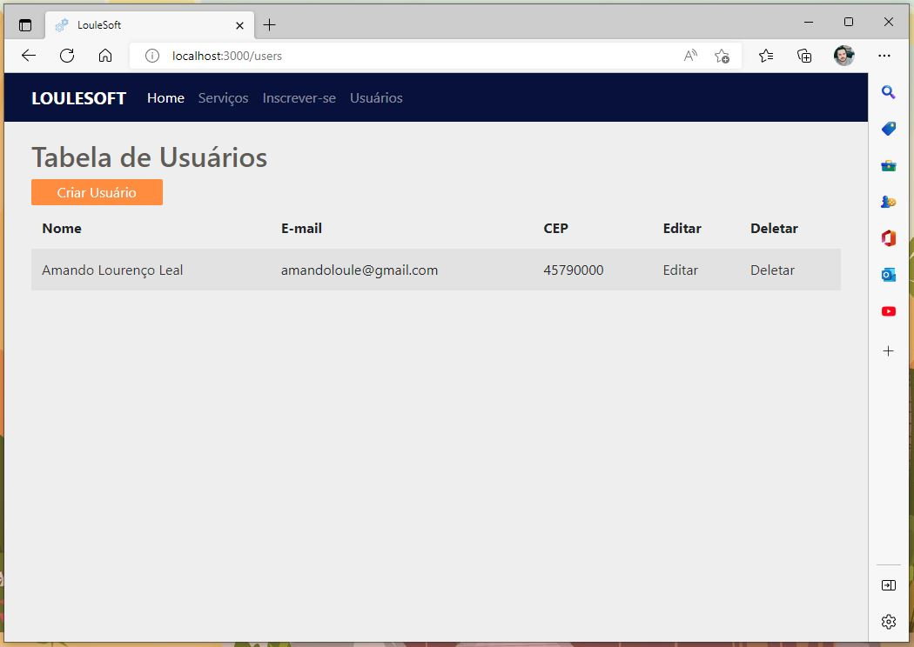
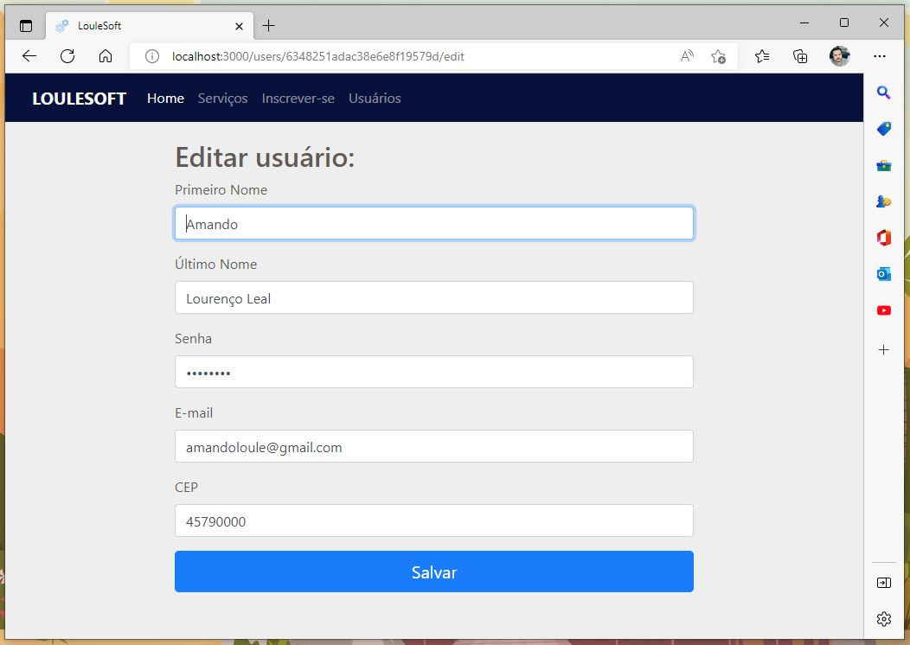
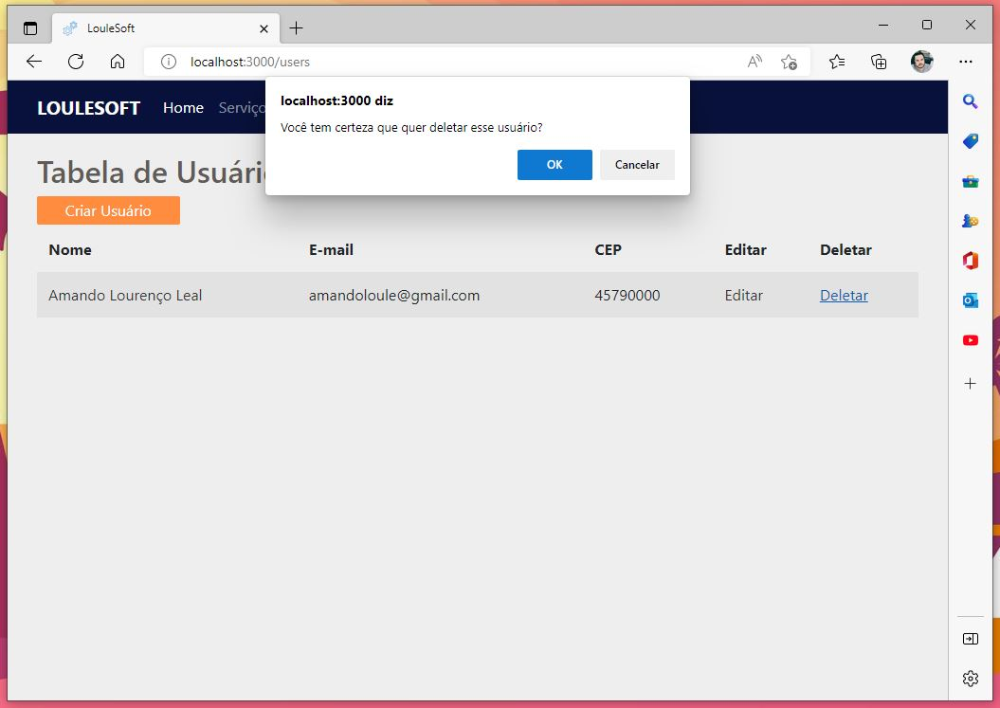

# CRUD in Node.js with Mongoose and Bootstrap / CRUD em Node.js com Mongoose e Bootstrap

A model of CRUD, to create, read, update and delete datas of Users, Services and Subscribers, made in Node.js, utilizing Mongoose and Bootstrap.
In relation to JavaScript, it was made utilizing CommonJS and Promises. A branch will be added with redone code with async/await.

Um modelo de CRUD, para criar, ler, atualizar e excluir dados de Usuários, Serviços e Inscritos, feito em Node.js, utilizando Mongoose e Bootstrap.
Em relação ao JavaScript, foi feito utilizando CommonJS e Promises. Um branch será adicionado com código refeito com async/await.

## Language and Technologies utilized / Linguagem e tecnologias utilizadas

- JavaScript ES2015
- Node.js 16.16.0
- Mongoose 6.0.13
- Bootstrap 4.6.2

## Preview

### Home

### Create

### Read

### Update

### Delete

